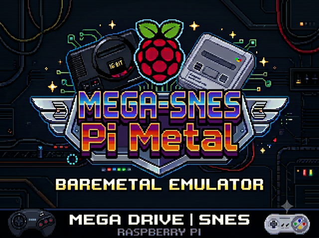

# MEGA-SNES Pi Metal



A unified, low-latency, bare-metal dual console emulator for the Raspberry Pi 3B+. This project merges the **SNES-PI** and **MEGA-PI** emulators into a single bare-metal kernel, allowing real-time switching between **Super Nintendo Entertainment System (SNES)** and **Sega Mega Drive / Sega CD (Genesis)** consoles directly from the On-Screen Display (OSD) menu.

Built on the **Circle C++ bare-metal environment**, **Snes9x**, and **Picodrive**, it runs directly on the ARM CPU without an underlying operating system, ensuring maximum speed, minimal input latency, and exact hardware timing.

🎥 **Video Demonstration**: [Watch MEGA-SNES Pi Metal running on a Raspberry Pi 3B+](https://youtu.be/jyMUjcQem-0)

---

### 🚀 Key Features

* **Dual-Console Emulation**: Run both SNES and Sega Mega Drive/Mega CD games from a single boot image.
* **Low Latency**: Direct hardware access bypassing OS overhead, providing sub-millisecond input and audio response.
* **Unified OSD Menu**: Dynamic graphical user interface featuring:
  * Dynamic header banners changing based on the selected system.
  * Real-time console switching via **L** and **R** shoulder buttons.
  * Auto-balanced alphabetical ROM folders (splits games across custom tabs based on active systems).
  * Favorite lists (`favorites.txt`) managed directly from the UI.
* **Save States Support**: Game states can be saved/loaded in Slot 0 (stored as `.s0` files alongside the ROMs) using **SELECT + D-pad Left** to save, and **SELECT + D-pad Right** to load.
* **High-Fidelity Audio**: Hardware-authentic audio resampling and interpolation (Gaussian audio for SNES).
* **Display Scaling**: Nearest-neighbor scaling for Sega games and linear/Gaussian aspect scaling for SNES games.

---

### 📁 SD Card Configuration

To load games and BIOS files, organize your SD card root directories as follows:

```
SD:/
 ├── bios/
 │    ├── bios_CD_U.bin      (Sega CD - US Region BIOS)
 │    ├── bios_CD_E.bin      (Mega CD - EU Region BIOS)
 │    └── bios_CD_J.bin      (Mega CD - JP Region BIOS)
 └── roms/
      ├── snes/              (SNES ROM files: .sfc, .smc)
      ├── megadrive/         (Mega Drive ROM files: .bin, .md, .gen)
      ├── megacd/            (Sega CD ROM files: .iso, .cue, .chd)
      └── favorites.txt      (Auto-generated file tracking favorite games)
```

> [!NOTE]
> Save state files (e.g., `Game.s0`) are saved directly into the folder containing the ROM being played.

---

### 🎮 Controller Layout (Gamesir Nova Lite & Standard Xbox 360)

The emulator supports standard XInput gamepads out-of-the-box (like the **Gamesir Nova Lite** detected under USB Vendor/Product ID `ven3537-1040`).

### 🖥️ OSD Menu Navigation
* **D-pad**: Navigate ROM list (Up / Down) or switch tabs (Left / Right).
* **A / B Buttons**: Start / select highlighted game.
* **Y Button**: Add to Favorites (`*` prefix).
* **X Button**: Remove from Favorites (Unfavorite).
* **L / R Shoulder Buttons**: Switch emulator console mode (**SNES** $\leftrightarrow$ **Mega Drive**).
* **START + SELECT**: Resets or exits the current game to return to the OSD menu.

---

### 🕹️ Gameplay Mappings

#### 1. Super Nintendo (SNES) Layout
Button mappings preserve physical positions matching the original SNES controller layout:

| Gamesir Button (Xbox Layout) | Physical Position | Mapped SNES Button |
| :--- | :--- | :--- |
| **A** | Bottom | **B** |
| **B** | Right | **A** |
| **X** | Left | **Y** |
| **Y** | Top | **X** |
| **LB** / **LT** | Left Shoulder / Trigger | **L** |
| **RB** / **RT** | Right Shoulder / Trigger | **R** |
| **Start** | Center-Right | **Start** |
| **Select** | Center-Left | **Select** |

#### 2. Sega Mega Drive / Genesis Layout
The controller layout dynamically adjusts depending on whether the game is a 3-button or 6-button title (detected automatically by ROM name or override tags like `(3b)`/`(6b)`):

##### 3-Button Controller Mode (Default for standard games)
Optimized face button mappings for comfortable 3-button play:

| Gamesir Button (Xbox Layout) | Mapped Sega Button |
| :--- | :--- |
| **A** | **A** |
| **B** | **B** |
| **X** | **C** |
| **RT** (Right Trigger) | **C** (Fallback) |
| **Start** | **Start** |
| **Select** | **Mode** |

##### 6-Button Controller Mode (Active for fighting/arcade games utilizing all buttons)
Maps the standard six-button Sega controller layout:

| Gamesir Button (Xbox Layout) | Mapped Sega Button |
| :--- | :--- |
| **A** | **A** |
| **B** | **B** |
| **RT** (Right Trigger) | **C** |
| **X** | **X** |
| **Y** | **Y** |
| **LT** (Left Trigger) / **RB** | **Z** |
| **LB** | **X** (Fallback) |
| **Start** | **Start** |
| **Select** | **Mode** |

---

### 💾 Save and Load State Combos
* **SELECT + D-pad Left**: Save state to Slot 0.
* **SELECT + D-pad Right**: Load state from Slot 0.

---

### 🔌 Retroflag Safe Shutdown & Reset (NESPi, SuperPi, MegaPi cases)

This bare-metal kernel provides native, hardware-level support for the physical buttons and status indicators on Retroflag cases without needing an underlying operating system or Python scripts.

#### Hardware Wiring & Pin Mapping
* **Power Button** (BCM GPIO 3): Monitored by the kernel. Toggling the power switch to OFF triggers a safe shutdown routine.
* **Reset Button** (BCM GPIO 2): Monitored by the kernel. Pressing the physical reset button triggers a system reboot.
* **Status LED** (BCM GPIO 14): Controlled by the kernel. Set to solid HIGH on boot and turns off upon shutdown.
* **Power Enable / Keep-Alive** (BCM GPIO 4): Kept HIGH on boot to maintain the case power supply circuit. Pulls LOW during shutdown to instruct the case hardware to safely cut the 5V line.

> [!IMPORTANT]
> Make sure the physical **SAFE SHUTDOWN** switch located on the internal PCB of your Retroflag case is set to **ON** to enable this hardware-level signaling.

#### OSD Safe Shutdown & Reset Messages
When a button press is detected, the emulator instantly halts gameplay or OSD menu loops and overlays an on-screen dialog:
* **Shutdown:** Clears the screen and displays `"SHUTTING DOWN..."` on a dark-themed container for 2 seconds. The FAT filesystem is cleanly unmounted, the status LED is turned off, and the power enable pin is pulled low to safely cut the power.
* **Reset:** Clears the screen and displays `"REBOOTING SYSTEM..."` for 2 seconds. The FAT filesystem is cleanly unmounted, and the system reboots back into the bootloader/OSD menu.

---


### 🛠️ Compilation & Deployment

To compile the projects, you must have the `arm-none-eabi` cross-compilation toolchain and standard build utilities installed on your host system.

#### 1. Installing the Toolchain & Build Tools

##### Linux (Ubuntu / Debian)
```bash
sudo apt update
sudo apt install gcc-arm-none-eabi g++-arm-none-eabi build-essential zip
```

##### Linux (Arch Linux)
```bash
sudo pacman -S arm-none-eabi-gcc arm-none-eabi-newlib base-devel zip
```

##### Linux (Fedora)
```bash
sudo dnf install gcc-arm-none-eabi newlib-arm-none-eabi make zip
```

##### macOS
Install the toolchain via [Homebrew](https://brew.sh/):
```bash
brew tap osx-cross/arm
brew install arm-none-eabi-gcc
```
Or alternatively:
```bash
brew install --cask gcc-arm-embedded
```
You will also need `make` and `zip` if you don't already have them installed:
```bash
brew install make zip
```

#### 2. Building the Unified Dual Emulator (Default)
To build the unified kernel:
```bash
cd snes-emulator
make -j$(nproc 2>/dev/null || sysctl -n hw.ncpu)
```
This produces `snes-emulator/boot/kernel8-32.img`. Copy the files inside the `snes-emulator/boot/` directory to the FAT32 boot partition of your SD card.

#### 3. Building the Standalone Mega Drive Emulator
To build the standalone Sega emulator:
```bash
cd mega-emulator
make -j$(nproc 2>/dev/null || sysctl -n hw.ncpu)
```
This produces `mega-emulator/boot/kernel8-32.img`. Copy the files inside `mega-emulator/boot/` to your SD card.

#### 4. Generating the SD Card Release Package
To compile and package all boot files along with the required SD card folder tree (`roms/snes`, `roms/megadrive`, `roms/megacd`, and `bios`) automatically:
```bash
./build_release.sh
```
This script clean builds the unified project and saves the final package to `release/sdcard_release.zip`. Extract the contents of this zip directly onto the root of a FAT32-formatted SD Card.

---

### 📚 Third-Party Resources & References

This project is built upon the incredible work of the following open-source projects:

* **Circle**: A C++ bare-metal environment for the Raspberry Pi.
  * Repository: [rsta2/circle](https://github.com/rsta2/circle)
* **PicoDrive**: A fast, highly-optimized Sega Mega Drive/Genesis and Sega CD emulator.
  * Repository: [notaz/picodrive](https://github.com/notaz/picodrive)
* **Snes9x**: A portable, high-compatibility Super Nintendo Entertainment System (SNES) emulator.
  * Repository: [snes9xgit/snes9x](https://github.com/snes9xgit/snes9x)

