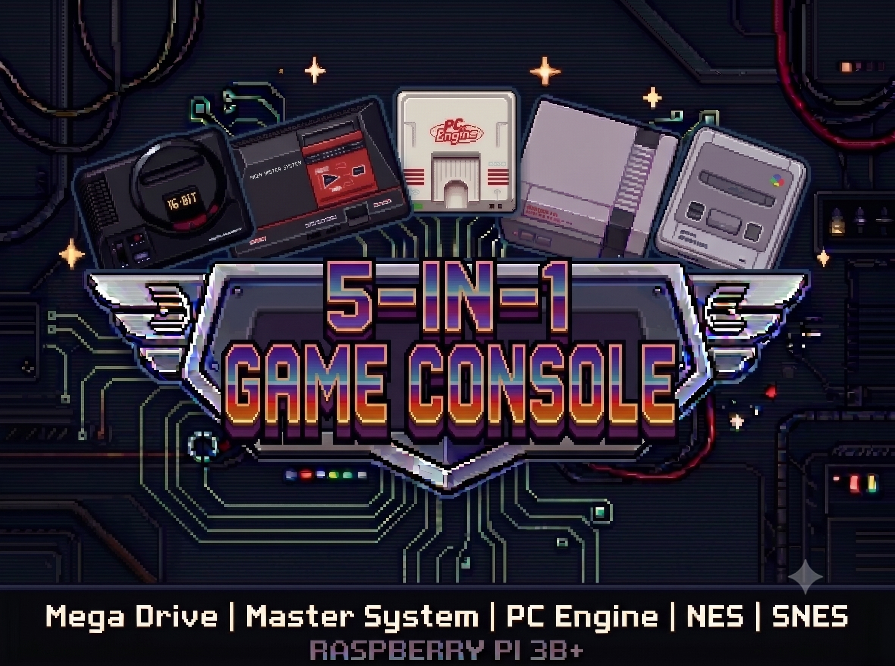

# Emulador de Consoles 5 em 1



*Leia este README em outros idiomas: [English](README.md) | [Português do Brasil](README.pt-BR.md)*

Um emulador multi-console bare-metal unificado e de baixa latência para o Raspberry Pi 3B+. Este projeto unifica os emuladores **SNES-PI** e **MEGA-PI** em um único kernel bare-metal. Inclui suporte para **Super Nintendo (SNES)**, **Nintendo Entertainment System (NES)** (via Nestopia), **Sega Mega Drive / Sega CD (Genesis)** (via PicoDrive), **Sega Master System (SMS)** (via PicoDrive) e **PC Engine / PC Engine CD (TurboGrafx-16)** (via Beetle PCE Fast), permitindo a troca em tempo real entre os sistemas diretamente no menu OSD (On-Screen Display).

Desenvolvido sobre o **ambiente C++ bare-metal Circle**, **Snes9x**, **PicoDrive**, **Nestopia** e **Beetle PCE Fast**, ele roda diretamente na CPU ARM sem a necessidade de um sistema operacional subjacente, garantindo velocidade máxima, latência de entrada mínima e tempo de hardware preciso.

🎥 **Demonstração em Vídeo**: [Assista ao MEGA-SNES Pi Metal rodando em um Raspberry Pi 3B+](https://youtu.be/jyMUjcQem-0)

---

### 🚀 Principais Recursos

* **Emulação Multi-Console**: Execute jogos de SNES, NES, Sega Master System, Sega Mega Drive/Mega CD e PC Engine/PC Engine CD a partir de uma única imagem de boot.
* **Baixa Latência**: Acesso direto ao hardware ignorando a sobrecarga do sistema operacional, proporcionando resposta de entrada e áudio em menos de um milissegundo.
* **Menu OSD Unificado**: Interface gráfica de usuário dinâmica com:
  * Banners de cabeçalho dinâmicos renderizados em fonte 12x22 de alta legibilidade, que mudam com base no sistema selecionado.
  * Troca de console em tempo real através dos botões superiores **L** e **R**.
  * Persistência do estado de seleção: ao retornar para o menu OSD, lembra a aba ativa exata e o último jogo jogado.
  * Navegação por 8 abas por sistema:
    * **SNES/NES/SMS**: `ALL` (TUDO), `FAV` (FAVORITOS) e 6 abas alfabéticas auto-balanceadas.
    * **Mega Drive**: `ALL`, `FAV`, 5 abas alfabéticas auto-balanceadas e `MCD` (Mega CD).
    * **PC Engine**: `ALL`, `FAV`, 5 abas alfabéticas auto-balanceadas e `PCD` (PC Engine CD).
  * 9 temas de cores integrados (`default`, `green`, `grayscale`, `cyberpunk`, `sapphire`, `synthwave`, `arctic`, `amber`, `ruby`) com rotação automática opcional a cada inicialização.
  * Lista de favoritos (`favorites.txt`) gerenciada diretamente pela interface do usuário.
* **Suporte a Save States**: Os estados do jogo podem ser salvos/carregados no Slot 0 (armazenados como arquivos `.s0` ao lado das ROMs) usando **SELECT + D-pad Esquerda** (ou **Gatilho/Botão L**) para salvar, e **SELECT + D-pad Direita** (ou **Gatilho/Botão R**) para carregar.
* **Recurso de Voltar no Tempo (Rewind)**: Rebobine até 5 segundos de jogo usando **SELECT + D-pad Cima** (ou tecla **F6** no teclado). O rewind automático é desativado para cartuchos SNES com SA-1 para evitar interrupções de desempenho e áudio, e para os jogos de Mega Drive *The Cursed Knight* e *Steel Empire* para evitar congelamentos de estabilidade de estado no PicoDrive; os estados manuais de salvar/carregar continuam disponíveis.
* **Áudio de Alta Fidelidade**: Reamostragem e interpolação de áudio autênticas do hardware (áudio Gaussiano para jogos SNES padrão, perfil de baixo custo para jogos SA-1 e áudio FM YM2413 para SMS).
* **Escalonamento de Tela**: Escalonamento nearest-neighbor para jogos Sega e escalonamento de proporção linear/Gaussiano para jogos SNES.
* **Protetor de Tela (Screensaver) e Mute de Áudio**: Escurece a tela em 50% e silencia a saída de áudio automaticamente após inatividade do controle. Ao pressionar qualquer botão do controle, o brilho total e o áudio são restaurados instantaneamente. Configurável via `cmdline.txt`.

---

### 📁 Configuração do Cartão SD

Para carregar os jogos e arquivos de BIOS, organize os diretórios na raiz do seu cartão SD da seguinte forma:

```
SD:/
 ├── cmdline.txt             (Parâmetros de boot, incluindo tempo limite do protetor de tela)
 ├── system_order.txt        (Arquivo de texto opcional para personalizar a ordem dos consoles e o sistema padrão no boot)
 ├── osd_theme.txt           (Arquivo de texto opcional para escolher o tema do OSD: default, green, grayscale, cyberpunk, sapphire, synthwave, arctic, amber, ruby, custom, all)
 ├── osd_colors.txt          (Arquivo de texto opcional para sobrescrever cores do OSD: fundo, borda, texto etc.)
 ├── bios/
 │    ├── bios_CD_U.bin      (BIOS do Sega CD - Região EUA)
 │    ├── bios_CD_E.bin      (BIOS do Mega CD - Região Europa)
 │    ├── bios_CD_J.bin      (BIOS do Mega CD - Região Japão)
 │    └── syscard3.pce       (BIOS do PC Engine CD - System Card 3.0)
 └── roms/
      ├── snes/              (Arquivos de ROM do SNES: .sfc, .smc)
      ├── nes/               (Arquivos de ROM do NES: .nes)
      ├── megadrive/         (Arquivos de ROM do Mega Drive: .bin, .md, .gen)
      ├── megacd/            (Arquivos de ROM do Sega CD: .iso, .cue, .chd)
      ├── mastersystem/      (Arquivos de ROM do Master System: .sms, .gg, .bin)
      ├── pce/               (Arquivos do PC Engine / PCE CD: .pce, .cue, .chd)
      └── favorites.txt      (Arquivo gerado automaticamente rastreando jogos favoritos)
```

> [!TIP]
> **Configurando o Tempo do Protetor de Tela**: Adicione ou edite `screensaver=<segundos>` no arquivo `cmdline.txt` na raiz do cartão SD (ex.: `screensaver=60` para 60 segundos, `screensaver=120` para 2 minutos, ou `screensaver=0` para desativar o protetor de tela completamente).

> [!IMPORTANT]
> **Perfil de Desempenho do Pi 3**: O `config.txt` incluído configura o Pi 3 para 1,4 GHz, com clock de core de 500 MHz e `over_voltage=4` para jogos exigentes. A refrigeração ativa é obrigatória; remova essas configurações se o sistema ficar instável.

> [!TIP]
> **Configurando a Duração da Tela de Splash**: Adicione ou edite `splash=<segundos>` no arquivo `cmdline.txt` na raiz do cartão SD (ex.: `splash=4` para 4 segundos, `splash=2` para 2 segundos, ou `splash=0` para desativar e não exibir a tela de splash no boot).

> [!TIP]
> **Múltiplas Telas de Splash & Rotação Automática**: Agora você pode salvar várias telas de splash no seu cartão SD! Basta criar uma pasta `splash/` na raiz do cartão SD (ex.: `SD:/splash/retro1.raw16`, `SD:/splash/retro2.raw16`) ou usar arquivos numerados na raiz (ex.: `SD:/Splash_Screen1.raw16`, `SD:/Splash_Screen2.raw16`). O emulador detectará automaticamente todas as imagens e alternará para a próxima tela de splash a cada inicialização!

> [!TIP]
> **Personalização da Ordem dos Sistemas**: Crie ou edite o arquivo `system_order.txt` na raiz do cartão SD para definir a ordem preferida de alternância dos consoles pelos botões superiores **L** / **R**. O primeiro sistema listado no arquivo se tornará automaticamente o console inicial padrão ao ligar o Pi (ex.: `megadrive`, `snes`, `nes`, `mastersystem`, `pce`).

> [!TIP]
> **Personalização do Tema do OSD**: Crie ou edite o arquivo `osd_theme.txt` na raiz do cartão SD e defina um destes valores: `default` (azul ardósia), `green` (verde CRT), `grayscale` (cinza stealth), `cyberpunk` (neon ciano), `sapphire` (azul safira), `synthwave` (violeta elétrico), `arctic` (menta polar), `amber` (ouro solar), `ruby` (vermelho rubi), `custom`, ou `all` (alterna entre todos os 9 temas a cada inicialização).

> [!TIP]
> **Personalização de Cores do OSD**: Defina `osd_theme.txt` como `custom` e então crie ou edite `osd_colors.txt` na raiz do cartão SD usando linhas `chave=valor` (exemplo: `background=#000000`, `border=8,12,16`, `text=26,28,30`). O repositório já inclui paletas prontas para copiar em `osd_colors.txt` (High Contrast Dark, Warm Amber Terminal, Ice Blue).

> [!NOTE]
> Os arquivos de Save State (ex.: `Jogo.s0` / `Jogo.srm`) são salvos diretamente na mesma pasta onde a ROM está localizada.

---

### 🎮 Mapeamento de Controles (Gamesir Nova Lite e Xbox 360 Padrão)

O emulador suporta gamepads padrão XInput nativamente (como o **Gamesir Nova Lite**, detectado com Vendor/Product ID `ven3537-1040`).

### 🖥️ Navegação no Menu OSD
* **D-pad**: Navegar na lista de ROMs (Cima / Baixo) ou alternar abas (Esquerda / Direita).
* **Botões A / B**: Iniciar / selecionar o jogo em destaque.
* **Botão Y**: Adicionar aos Favoritos (prefixo `*`).
* **Botão X**: Remover dos Favoritos (Desfavoritar).
* **SELECT + X**: Forçar revarredura dos diretórios de ROMs no cartão SD e recriar o arquivo `library.cache`.
* **START + SELECT**: Reinicia ou sai do jogo atual para retornar ao menu OSD.

> [!TIP]
> **Cache da Biblioteca de ROMs (Boot Rápido)**: Ao inicializar, o sistema carrega a lista de ROMs diretamente do cache em `SD:/roms/library.cache` em menos de 2ms. Caso adicione ou remova ROMs no cartão SD, pressione **SELECT + X** no menu OSD (ou apague o arquivo `SD:/roms/library.cache` no computador) para realizar uma nova varredura completa nos diretórios.

---

### 🕹️ Mapeamentos nos Jogos

#### 1. Layout do Super Nintendo (SNES)
O mapeamento de botões preserva as posições físicas do controle original do SNES:

| Botão no Gamesir (Layout Xbox) | Posição Física | Botão Mapeado no SNES |
| :--- | :--- | :--- |
| **A** | Inferior | **B** |
| **B** | Direita | **A** |
| **X** | Esquerda | **Y** |
| **Y** | Superior | **X** |
| **LB** / **LT** | Superior Esquerdo / Gatilho | **L** |
| **RB** / **RT** | Superior Direito / Gatilho | **R** |
| **Start** | Centro-Direito | **Start** |
| **Select** | Centro-Esquerdo | **Select** |

#### 2. Layout do Sega Mega Drive / Genesis
O layout do controle se ajusta dinamicamente dependendo se o jogo é de 3 botões ou 6 botões (detectado automaticamente pelo nome da ROM ou tags como `(3b)`/`(6b)`):

##### Modo de Controle de 3 Botões (Padrão para jogos convencionais)
Mapeamento otimizado para uma jogabilidade confortável com 3 botões:

| Botão no Gamesir (Layout Xbox) | Botão Mapeado na Sega |
| :--- | :--- |
| **A** | **A** |
| **B** | **B** |
| **X** | **C** |
| **RT** (Gatilho Direito) | **C** (Alternativo) |
| **Start** | **Start** |
| **Select** | **Mode** |

##### Modo de Controle de 6 Botões (Ativo para jogos de luta/arcade que usam todos os botões)
Mapeia o layout padrão do controle de seis botões da Sega:

| Botão no Gamesir (Layout Xbox) | Botão Mapeado na Sega |
| :--- | :--- |
| **A** | **A** |
| **B** | **B** |
| **RT** (Gatilho Direito) | **C** |
| **X** | **X** |
| **Y** | **Y** |
| **LT** (Gatilho Esquerdo) / **RB** | **Z** |
| **LB** | **X** (Alternativo) |
| **Start** | **Start** |
| **Select** | **Mode** |

##### 3. Layout do PC Engine (PCE) / TurboGrafx-16
O mapeamento de botões preserva as posições físicas do controle original de 2 botões do PC Engine:

| Botão no Gamesir (Layout Xbox) | Posição Física | Botão Mapeado no PCE |
| :--- | :--- | :--- |
| **A** | Inferior | **Button I** |
| **B** | Direita | **Button II** |
| **Start** | Centro-Direito | **Run** |
| **Select** | Centro-Esquerdo | **Select** |

---

### 💾 Atalhos para Salvar, Carregar e Voltar no Tempo (Rewind)
* **SELECT + D-pad Esquerda** OU **SELECT + Botão/Gatilho L**: Salvar estado no Slot 0.
* **SELECT + D-pad Direita** OU **SELECT + Botão/Gatilho R**: Carregar estado do Slot 0.
* **SELECT + D-pad Cima** (ou **F6** no teclado): Voltar no tempo (buffer de 5 segundos).

---

### 🔌 Safe Shutdown & Reset para Cases Retroflag (NESPi, SuperPi, MegaPi)

Este kernel bare-metal possui suporte nativo em nível de hardware para os botões físicos e LEDs indicadores de status nas cases Retroflag, sem necessitar de um sistema operacional ou scripts Python.

#### Conexão de Hardware & Mapeamento de Pinos
* **Botão Power** (BCM GPIO 3): Monitorado pelo kernel. Alternar o interruptor de energia para OFF inicia a rotina de desligamento seguro.
* **Botão Reset** (BCM GPIO 2): Monitorado pelo kernel. Pressionar o botão físico de reset reinicia o sistema.
* **LED de Status** (BCM GPIO 14): Controlado pelo kernel. Mantido aceso (HIGH) na inicialização e desligado após o encerramento.
* **Power Enable / Manutenção de Energia** (BCM GPIO 4): Mantido em HIGH no boot para alimentar o circuito da case. Mudado para LOW ao desligar para instruir a case a cortar a linha de 5V com segurança.

> [!IMPORTANT]
> Certifique-se de que a chave física **SAFE SHUTDOWN** localizada na placa interna da sua case Retroflag esteja na posição **ON** para ativar o sinal de hardware.

#### Mensagens do Menu OSD para Shutdown & Reset
Quando o pressionamento de um botão é detectado, o emulador interrompe instantaneamente o jogo ou a navegação do menu e exibe uma caixa de diálogo na tela:
* **Desligamento (Shutdown):** Limpa a tela e exibe `"SHUTTING DOWN..."` em uma caixa com tema escuro por 2 segundos. O sistema de arquivos FAT é desmontado com segurança, o LED de status desliga e o pino de energia é colocado em LOW para cortar a alimentação.
* **Reinicialização (Reset):** Limpa a tela e exibe `"REBOOTING SYSTEM..."` por 2 segundos. O sistema de arquivos FAT é desmontado com segurança e o sistema reinicia no bootloader/menu OSD.

---

### 🛠️ Compilação e Instalação

Para compilar o projeto, você deve ter a toolchain de compilação cruzada `arm-none-eabi` e utilitários padrão de build instalados em seu sistema.

#### 1. Instalando a Toolchain e Ferramentas de Build

##### Linux (Ubuntu / Debian)
```bash
sudo apt update
sudo apt install gcc-arm-none-eabi g++-arm-none-eabi build-essential zip
```

##### Linux (Arch Linux)
```bash
sudo pacman -S arm-none-eabi-gcc arm-none-eabi-newlib base-devel zip
```

##### Linux (Fedora)
```bash
sudo dnf install gcc-arm-none-eabi newlib-arm-none-eabi make zip
```

##### macOS
Instale a toolchain via [Homebrew](https://brew.sh/):
```bash
brew tap osx-cross/arm
brew install arm-none-eabi-gcc
```
Ou alternativamente:
```bash
brew install --cask gcc-arm-embedded
```
Você também precisará do `make` e `zip` se ainda não os tiver instalados:
```bash
brew install make zip
```

#### 2. Compilando o Emulador Bare-Metal 5-em-1
Para compilar o kernel do emulador multi-console 5-em-1:
```bash
cd main-emulator
make -j$(nproc 2>/dev/null || sysctl -n hw.ncpu)
```
Isso gera o arquivo `main-emulator/kernel8-32.img`.

#### 3. Compilando os Alvos de Emuladores Standalone
- **Super Nintendo**: `cd snes-emulator && make -j$(nproc)` $\rightarrow$ gera `snes-emulator/kernel8-32.img`
- **Sega Mega Drive**: `cd mega-emulator && make -j$(nproc)` $\rightarrow$ gera `mega-emulator/kernel8-32.img`
- **Sega Master System**: `cd master-emulator && make -j$(nproc)` $\rightarrow$ gera `master-emulator/kernel8-32.img`

#### 5. Gerando o Pacote de Lançamento (Release) para Cartão SD
Para compilar e empacotar automaticamente todos os arquivos de inicialização junto com a estrutura de pastas do cartão SD (`roms/snes`, `roms/megadrive`, `roms/megacd`, `roms/mastersystem` e `bios`):
```bash
./build_release.sh
```
Este script realiza o build limpo do projeto unificado e salva o pacote final em `release/sdcard_release.zip`. Extraia o conteúdo deste arquivo zip diretamente na raiz de um cartão SD formatado em FAT32.

---

### 📚 Recursos e Referências de Terceiros

Este projeto foi construído sobre o trabalho incrível dos seguintes projetos de código aberto:

* **Circle**: Um ambiente C++ bare-metal para Raspberry Pi.
  * Repositório: [rsta2/circle](https://github.com/rsta2/circle)
* **PicoDrive**: Um emulador rápido e altamente otimizado de Sega Mega Drive/Genesis/Master System e Sega CD.
  * Repositório: [notaz/picodrive](https://github.com/notaz/picodrive)
* **Snes9x**: Um emulador portátil e de alta compatibilidade de Super Nintendo Entertainment System (SNES).
  * Repositório: [snes9xgit/snes9x](https://github.com/snes9xgit/snes9x)
* **Nestopia**: Um emulador altamente preciso de Nintendo Entertainment System (NES/Famicom) usado como base para a implementação de NES deste projeto.
  * Página do projeto: [nestopia.sourceforge.net](http://nestopia.sourceforge.net/)
* **Beetle PCE Fast**: Um núcleo de emulador de PC Engine (TG16) / PC Engine CD de alto desempenho (baseado no Mednafen) usado para a emulação de PC Engine deste projeto.
  * Repositório: [libretro/beetle-pce-fast-libretro](https://github.com/libretro/beetle-pce-fast-libretro)
